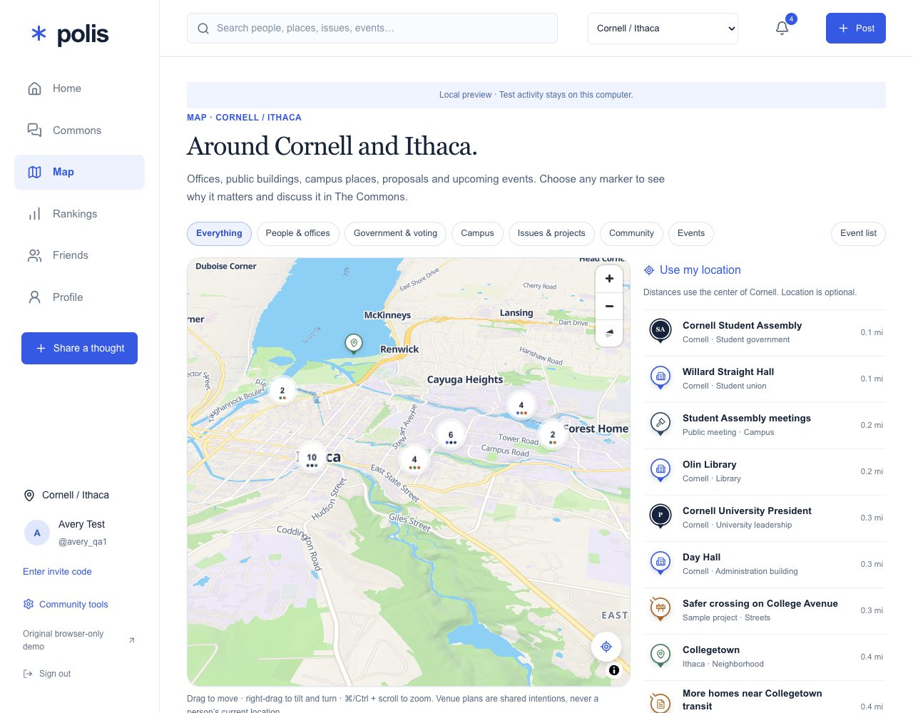
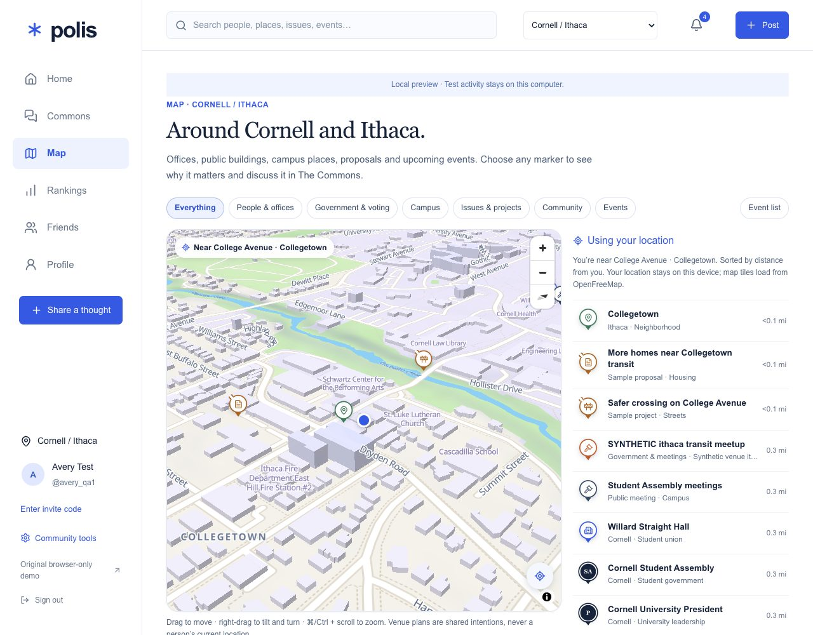
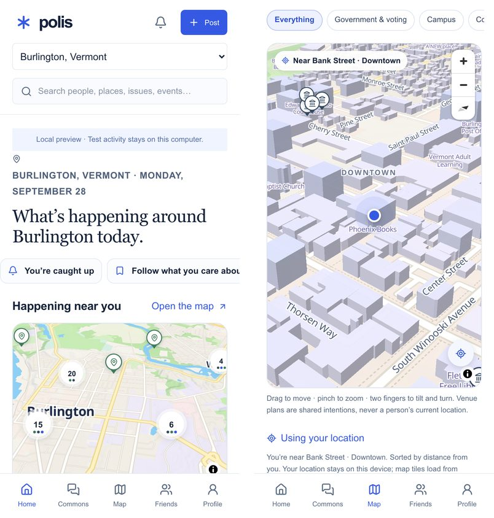

# Polis

**Politics starts close to home.** Polis is a social app for local civic life: find your town or campus, see its offices, public places and events on a map, and talk through local questions with neighbors — with room to agree, disagree, or say you're still learning.

**Pilot:** [polis-community.raymondaw2006.chatgpt.site](https://polis-community.raymondaw2006.chatgpt.site) — public landing page; members sign in with the OpenAI login (email or Google). The hosted app lags this repository; see [Status](#status).



| Street level with *Use my location* | On a phone |
| --- | --- |
|  |  |

Screenshots use synthetic accounts on a local build. Map data © OpenStreetMap contributors, tiles by OpenFreeMap.

## What you can do

- **Find your community, anywhere.** Search any town or university (OpenStreetMap), or list communities near you. Start the first commons for a town; nearby duplicates are joined instead of created. Campus and organization communities are joined with invitation codes.
- **See it on the map.** A bright, Snap-style 3D map of offices, public buildings, campus places, proposals and events. Nearby places group into count bubbles until you zoom in. *Use my location* glides to street level and names the street you're on — your location never leaves the device.
- **Local news that matters.** Stories from student papers, town outlets and an open news index, ranked by how local they are, how much they touch student life, how many people here are discussing them and how widely they are reported, with the reasons shown. Start a forum on any story; sensitive stories come with support resources.
- **Understand what is being decided.** Plain-language explainers turn laws, proposals and official documents into what changes, who it affects, where it stands and how to weigh in, with the originals linked. One is featured on Home each day.
- **Talk it through in the Commons.** Local and national questions, debates and sourced updates about real places and decisions. Replies can carry a perspective; reactions are *Agree*, *Thought-provoking* and *Want to understand more*. Polis never assigns anyone a political identity.
- **Show up.** Discover events, save them privately, mark Interested or Going with an audience you choose, and see friends' shared plans (never anyone's live location).
- **Keep your own priorities.** Order the issues you care about and rate proposals privately; share a snapshot only when you choose.
- **Stay in control.** Posts default to Friends. Mute, block and report are always available. Private notes, saves and plans stay private.

## Status

| | |
| --- | --- |
| Hosted pilot | Public landing and member sign-in are live. The member app there predates this branch; publishing needs the Sites workflow from a network that can reach the Sites source host (it times out from the Cornell network). See [deployment](docs/deployment.md). |
| This branch | Consolidates every candidate branch (communities anywhere, Commons, civic map, events, invitations, motion) plus the new map. |
| Verified locally | 91 unit and service tests on real migrations; 8 real-browser suites (social cycle, signup, invitations, Commons, civic, anywhere, milestone, motion) and 3 HTTP-boundary suites, at desktop and phone widths. |
| Not yet verified | Hosted acceptance with three real accounts, real-device gestures and a screen-reader pass, and production capacity of the public OpenStreetMap services. |

Campus association by email domain is switched off until a sign-in adapter can assert that an email is verified; until then campuses use invitation codes. Sample civic records are labeled *Sample*. See the [roadmap](docs/roadmap.md) for what is next.

## Run locally

Requires Node **24.14.0** (`.nvmrc`) and npm **11.9.0**. No cloud account, API key or production database is needed.

```sh
git clone https://github.com/RAWCoder123/Polis.git
cd Polis
nvm install && nvm use
npm ci
cp .env.example .dev.vars
npm run db:migrate:local
npm run dev
```

Open **http://localhost:5173/**. Local sign-in uses a visibly synthetic identity (Seedy, the local pilot owner). Set `POLIS_TEST_ACCOUNTS=1` to sign in as other synthetic accounts with `/signin-with-chatgpt?test_account=beta_b` or a run-scoped `qa_<suite>_<run>_<role>` name; unknown names are refused. This is **not** hosted authentication. `.dev.vars`, `.wrangler/state` and `.sites-runtime` stay local and out of Git.

| Setting | Where | Purpose |
| --- | --- | --- |
| `POLIS_OWNER_EMAIL` | `.dev.vars` locally; Sites runtime setting in production | Server-only owner bootstrap identity. The example is synthetic. |
| `DB` | `.openai/hosting.json` and local Wrangler config | Logical D1 binding, not a password or URL. |

No `NEXT_PUBLIC_*` or `VITE_*` variables are needed; never put secrets in them.

## Validate

```sh
npm run lint        # 0 errors; 7 inherited warnings in the original demo
npm run typecheck
npm test            # 91 tests
npm run build
```

With `npm run dev` running (set `POLIS_TEST_ORIGIN` if not on port 5173), `npm run test:http`, `test:social-http` and `test:events-http` check the Worker boundary, and `npm run test:browser` plus the other `test:*-browser` suites drive real Chromium sessions. Browser suites need `POLIS_TEST_ACCOUNTS=1` on the dev server.

GitHub Actions is prepared in [docs/ci.yml](docs/ci.yml) but not active until the repository grants workflow permission.

## How it's built

React 19 with Next.js App Router conventions on Vinext/Vite, TypeScript and Tailwind, deployed as a Cloudflare Worker with D1 on OpenAI Sites. Every social read and write goes through one API route and a server-side service that enforces membership, audience, ownership, blocking and muting; Drizzle defines the schema and versioned migrations. Maps use MapLibre GL with OpenFreeMap vector tiles and a custom Polis style.

## Documentation

| Topic | Read |
| --- | --- |
| How the code fits together | [Architecture](docs/architecture.md) · [Design system](DESIGN.md) · [Motion](docs/motion.md) · [Map](docs/map.md) · [Explainers](docs/explainers.md) · [Local news](docs/local-news.md) |
| Working on Polis | [Contributing](CONTRIBUTING.md) · [Agent guidance](AGENTS.md) · [Roadmap](docs/roadmap.md) |
| Features | [Communities anywhere](docs/anywhere.md) · [Campus Commons and civic map](docs/campus-civic-map.md) · [Commons pilot](docs/commons-pilot.md) · [Events](docs/event-pilot.md) · [Event sources](docs/event-sources.md) · [Invitation codes](docs/invitation-codes.md) · [Open signup](docs/open-signup.md) |
| Hosting and pilot | [Deployment](docs/deployment.md) · [Pilot setup](docs/PILOT_SETUP.md) · [Authentication path](docs/authentication-path.md) · [Hosted verification](docs/hosted-pilot-verification.md) |
| Verification records | [Verification](docs/VERIFICATION.md) · [Social cycle](docs/social-cycle-verification.md) · [Events](docs/event-verification.md) · [Civic milestone review](docs/claude-review-and-milestone.md) |

## License

No project-wide open-source license has been chosen; public source does not by itself grant one. Third-party notices in `build/` and `vendor/` are preserved, and the bundled map outlines in `public/maps` are ODbL (see their README).
